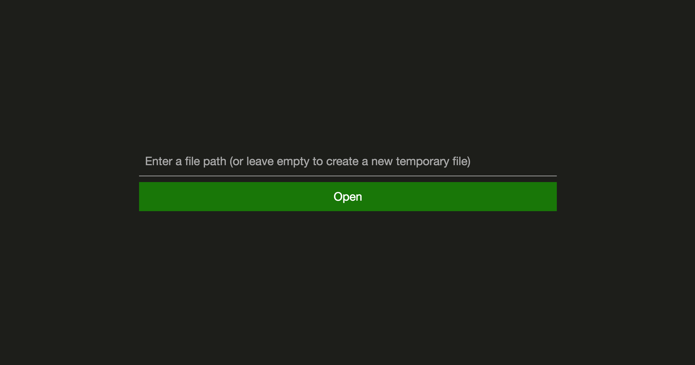
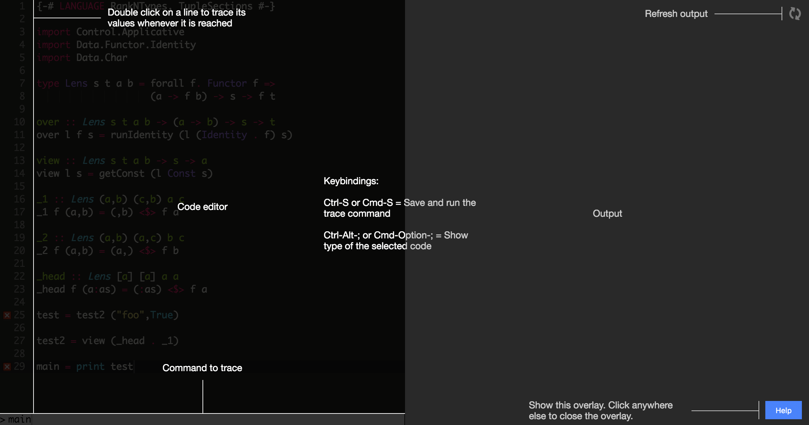
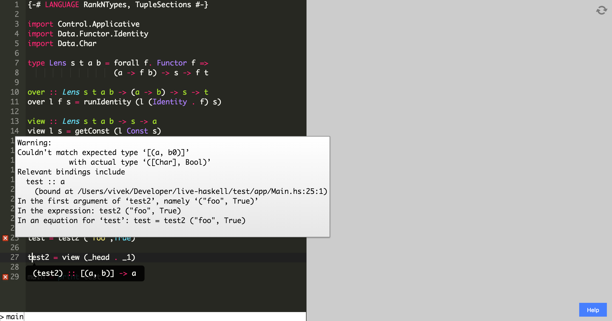
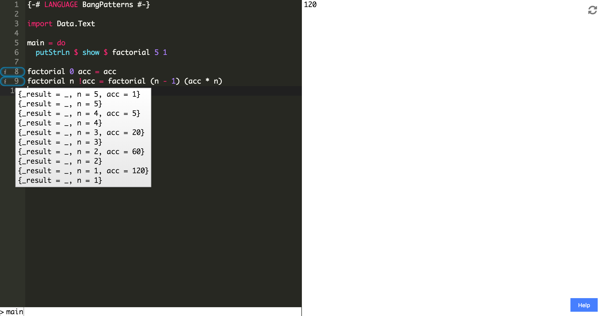

Live Haskell
============

An integrated editing and debugging environment for Haskell. It supports Stack projects, and enables fast, interactive evaluation by

1. Running whenever you save the file
2. Running IO within a sandbox (allows for idempotent behavior that still works as if you were running the code live)
3. Showing errors inline
4. Displaying type tooltips
5. Tracing execution so that you can examine variable bindings at a particular line, across all function calls

Screenshots
-----------

Initial open page.

Help screen.

Showing type tooltip and inline errors.

Tracing the execution of tail recursive factorial.

Usage
-----
You need to have [Stack](http://docs.haskellstack.org/en/stable/README/) installed. Once you do, install [ghci-ng](https://github.com/chrisdone/ghci-ng) globally using `stack install ghci-ng`. Open `server/` in your terminal, then run `stack build` and then `stack exec server`. Finally, open [http://localhost:8000/](http://localhost:8000/) in your browser.
